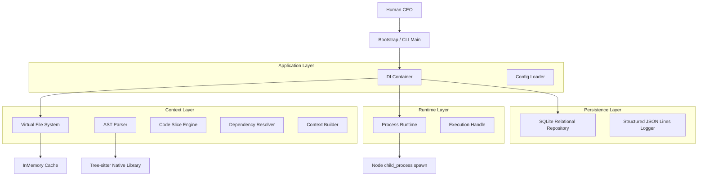

# Local-First AI Software Engineering OS (SE-OS)

SE-OS is a provider-agnostic, event-driven, local-first Operating System designed to orchestrate multiple AI coding agents (Claude CLI, Gemini CLI, Ollama, etc.) to function as an integrated software development company.

---

## 🏗 System Architecture Diagram

---

## 🚀 Runtime Kernel & Process Execution Model

The **Provider Runtime Kernel** provides a robust, cross-platform layer to spawn, monitor, and pipe data into external CLI engines (both local LLMs like Ollama and cloud agent CLIs like Claude Code).

### Key Features:
* **Interactive PTY Pipe**: Full streaming and piping support for `stdin`, `stdout`, and `stderr` streams, allowing interactive shell loop execution.
* **Process Lifecycle State Machine**: Tracks execution state transitions (`CREATED`, `STARTING`, `RUNNING`, `STOPPING`, `FINISHED`, `FAILED`, `CANCELLED`, `TIMEOUT`).
* **Active Cancellation & Isolation**: Integrated with native `AbortController` cancellation signals and process-safe cleanup guards.
* **Resource Monitoring**: Tracks process start/end timestamps, PIDs, duration metrics, and exit signals with zero external dependencies.
* **Security Safeguards**: Executes executables directly without string-concatenated shell commands, eliminating the risk of shell injections.

---

## 📈 Milestone Development Progress

| Milestone | Title | Focus Area | Status |
| :--- | :--- | :--- | :--- |
| **Milestone 1** | Kernel Core & Telemetry | SQLite Persistence, Structured Logging, DI Bootstrapping | **Completed & Merged** |
| **Milestone 2** | VFS & AST Context Slicer | Tree-sitter Parser, Slicing Engine, Transitive Dependency Resolver | **Completed & Merged** |
| **Milestone 3** | Provider Runtime Kernel | Pseudo-Terminal Spawner, Cancellation, Resource Monitoring | **Implemented - In Review** |
| **Milestone 4** | State Machine & Task Scheduler | Event Bus, DAG State Transitions, FIFO Queue | Planned |
| **Milestone 5** | DAG Workflow Compiler | Codebase Workflow Orchestrator, Human Review Gate | Planned |
| **Milestone 6** | Sandboxed Workspace & TUI | Sandboxing, TUI Dashboard UI | Planned |
