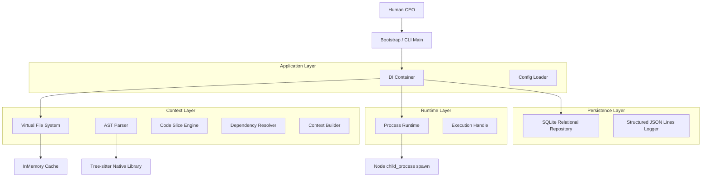

# Local-First AI Software Engineering OS (SE-OS)

SE-OS is a provider-agnostic, event-driven, local-first Operating System designed to orchestrate multiple AI coding agents (Claude CLI, Gemini CLI, Ollama, etc.) to function as an integrated software development company.

---

## 🏗 System Architecture Diagram



---

## 🚀 Runtime Kernel & Process Execution Model

The **Provider Runtime Kernel** provides a robust, cross-platform layer to spawn, monitor, and pipe data into external CLI engines (both local LLMs like Ollama and cloud agent CLIs like Claude Code).

### Key Features:
* **Interactive PTY Pipe**: Full streaming and piping support for `stdin`, `stdout`, and `stderr` streams, allowing interactive shell loop execution.
* **Process Lifecycle State Machine**: Tracks execution state transitions (`CREATED`, `STARTING`, `RUNNING`, `STOPPING`, `FINISHED`, `FAILED`, `CANCELLED`, `TIMEOUT`).
* **Active Cancellation & Isolation**: Integrated with native `AbortController` cancellation signals and process-safe cleanup guards.
* **Resource Monitoring**: Tracks process start/end timestamps, PIDs, duration metrics, and exit signals with zero external dependencies.
* **Security Safeguards**: Executes executables directly without string-concatenated shell commands, eliminating the risk of shell injections.

---

## 📈 Milestone Development Progress

| Milestone | Title | Focus Area | Status |
| :--- | :--- | :--- | :--- |
| **Milestone 1** | Kernel Core & Telemetry | SQLite Persistence, Structured Logging, DI Bootstrapping | **Completed & Merged** |
| **Milestone 2** | VFS & AST Context Slicer | Tree-sitter Parser, Slicing Engine, Transitive Dependency Resolver | **Completed & Merged** |
| **Milestone 3** | Provider Runtime Kernel | Pseudo-Terminal Spawner, Cancellation, Resource Monitoring | **Implemented - In Review** |
| **Milestone 4** | State Machine & Task Scheduler | Event Bus, DAG State Transitions, FIFO Queue | Planned |
| **Milestone 5** | DAG Workflow Compiler | Codebase Workflow Orchestrator, Human Review Gate | Planned |
| **Milestone 6** | Sandboxed Workspace & TUI | Sandboxing, TUI Dashboard UI | Planned |

---

## 🏃‍♂️ Quick Start Demo

The platform includes an end-to-end executable demonstration that validates VFS file parsing, AST slicing, dependency resolution, process execution, and output streaming.

### 1. Fallback / Mock Mode (Default)
By default, if the Claude CLI is not detected on your system, the demo automatically falls back to a simulated `MockProvider`:

```bash
# Run E2E Demo in Fallback/Mock Mode
npx ts-node src/demo.ts
```

### 2. Real AI Mode (Claude CLI)
To run the demo with a real AI provider:
1. **Install Claude CLI**: Install the official Anthropic Claude CLI tool on your system path.
   ```bash
   npm install -g @anthropic-ai/claude-code
   ```
2. **Authenticate**: Log in to your Anthropic account through the CLI.
   ```bash
   claude login
   ```
3. **Configure Provider**: Set the configuration environment variables in your `.env` or pass them inline:
   ```bash
   PROVIDER_TYPE=claude
   CLAUDE_EXECUTABLE=claude
   ```
4. **Execute**:
   ```bash
   npx ts-node src/demo.ts
   ```

### Expected Output:
1. Bootstraps the DI container and starts connection to SQLite.
2. Creates a mock TypeScript file under `demo_workspace/math_helper.ts`.
3. Runs the AST Context Builder on the target symbol `add`, resolving its class structure and `OperationConfig` interface dependencies.
4. Detects the Claude CLI in the system path (or falls back to mock) and spawns it using `ProcessRuntime`.
5. Feeds the sliced context into the provider, streaming back the actual refactored output or response chunk-by-chunk.
6. Displays final execution metrics (PID, duration, success/exit status) and cleans up the workspace.
