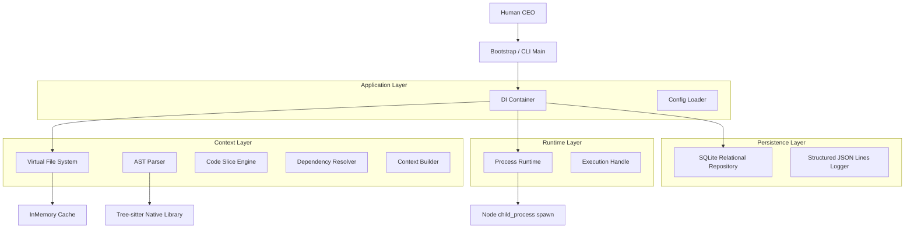

# Local-First AI Software Engineering OS (SE-OS)

SE-OS is a provider-agnostic, event-driven, local-first Operating System designed to orchestrate multiple AI coding agents (Claude CLI, Gemini CLI, Ollama, etc.) to function as an integrated software development company.

---

## 🏗 System Architecture Diagram



---

## 🚀 Runtime Kernel & Process Execution Model

The **Provider Runtime Kernel** provides a robust, cross-platform layer to spawn, monitor, and pipe data into external CLI engines (both local LLMs like Ollama and cloud agent CLIs like Claude Code).

### Key Features:
* **Interactive PTY Pipe**: Full streaming and piping support for `stdin`, `stdout`, and `stderr` streams, allowing interactive shell loop execution.
* **Process Lifecycle State Machine**: Tracks execution state transitions (`CREATED`, `STARTING`, `RUNNING`, `STOPPING`, `FINISHED`, `FAILED`, `CANCELLED`, `TIMEOUT`).
* **Active Cancellation & Isolation**: Integrated with native `AbortController` cancellation signals and process-safe cleanup guards.
* **Resource Monitoring**: Tracks process start/end timestamps, PIDs, duration metrics, and exit signals with zero external dependencies.
* **Security Safeguards**: Executes executables directly without string-concatenated shell commands, eliminating the risk of shell injections.

---

## 📈 Milestone Development Progress

| Milestone | Title | Focus Area | Status |
| :--- | :--- | :--- | :--- |
| **Milestone 1** | Kernel Core & Telemetry | SQLite Persistence, Structured Logging, DI Bootstrapping | **Completed & Merged** |
| **Milestone 2** | VFS & AST Context Slicer | Tree-sitter Parser, Slicing Engine, Transitive Dependency Resolver | **Completed & Merged** |
| **Milestone 3** | Provider Runtime Kernel | Pseudo-Terminal Spawner, Cancellation, Resource Monitoring | **Implemented - In Review** |
| **Milestone 4** | State Machine & Task Scheduler | Event Bus, DAG State Transitions, FIFO Queue | Planned |
| **Milestone 5** | DAG Workflow Compiler | Codebase Workflow Orchestrator, Human Review Gate | Planned |
| **Milestone 6** | Sandboxed Workspace & TUI | Sandboxing, TUI Dashboard UI | Planned |

---

## 📂 Application Layer & Task Execution

SE-OS separates low-level infrastructure (databases, terminals, parsers) from software engineering use cases via the **Application Layer**. 

### TaskExecutionService
The `TaskExecutionService` is the single entry point for orchestrating and executing engineering tasks. 

#### Responsibilities:
1. **Validation**: Validates incoming `EngineeringTask` models to prevent malformed requests.
2. **Context Compilation**: Calls `IContextBuilder` to build a minimal code context slice matching the task description.
3. **AI Execution**: Resolves the configured provider (`MockProvider` or `ClaudeProvider`) and executes the task against the gathered context.
4. **Structured Results**: Wraps execution output, runtimes, status metrics, and errors into a clean, provider-independent `ExecutionResult`.

### Code Modification Pipeline
The platform includes an automated pipeline that applies the generated code changes back to the workspace safely.

#### Pipeline Flow:
1. **ResponseParser**: Extracts fenced markdown code blocks or plain source code from the raw AI response and associates them with target files based on filename headers, comments, or textual context clues.
2. **PatchGenerator**: Inspects the parsed code blocks, validating them against the allowed `workspaceFiles` of the `EngineeringTask` to prevent writing unauthorized files.
3. **WorkspaceUpdater**: Performs atomic writes to the workspace files, keeping identical files skipped to save filesystem cycles and preserving original formatting.

### Execution Validation Pipeline
To ensure safety and protect the codebase, the platform includes a validation gate that inspects raw AI responses and parsed blocks before any disk modifications are executed.

#### Validation Checks:
1. **Empty/Conversational Detection**: Detects empty or purely conversational responses (prose) and prevents them from overwriting source files.
2. **Structural Integrity**: Checks for unbalanced brackets/braces and malformed fenced code blocks to prevent introducing syntax errors.
3. **Language Matching**: Verifies that the language tag in markdown blocks (e.g. `typescript`) aligns with the file extension (e.g. `.ts`).
4. **Confidence Score**: Dynamically calculates a parser confidence score (0.0 to 1.0) and rejects patches falling below the threshold.

### Autonomous Retry Engine
To recover from compiler errors, syntax anomalies, and test failures, the platform implements an autonomous self-repair loop:

#### Retry Algorithm:
1. **Verification Gate**: After patches are applied, the `VerificationRunner` runs verification commands sequentially.
2. **Failure Analysis**: If validation fails or a verification command exits with a non-zero code, the `RetryEngine` captures:
   - The original task instructions.
   - The previously generated response.
   - Captured compiler errors/test outputs and logs.
3. **Correction Prompts**: Constructs a structured correction instruction detailing the previous attempt failures and errors.
4. **Iterative Repair**: Invokes the provider with the correction instruction to re-attempt patching and verification, up to `MAX_RETRY_COUNT` (default: 3). If verification passes, the loop terminates immediately with success.

### Git Integration Stage
Git acts as the final stage of the engineering execution pipeline, providing safety commits on success and automatic rollbacks on failure.

#### Configuration:
- `AUTO_COMMIT=true|false`: Automatically stage and commit verified task changes to Git on success (default: `true`).
- `AUTO_ROLLBACK=true|false`: Automatically discard modified and untracked files if verification ultimately fails after all retries (default: `true`).
- `COMMIT_MESSAGE_TEMPLATE`: Structured commit message template supporting conventional commits. Templated fields include `{{taskId}}` and `{{taskDescription}}`.

#### Rollback Execution:
If verification fails, the system detects all files modified across all retry attempts. It performs a targeted `git checkout -- <file>` for tracked files and deletes untracked files, safely restoring the repository to its clean state before execution without disrupting other unrelated modifications.

---

## 🏃‍♂️ Quick Start Demo

The platform includes an end-to-end executable demonstration that validates VFS file parsing, AST slicing, dependency resolution, process execution, and output streaming.

### 1. Fallback / Mock Mode (Default)
By default, if the Claude CLI is not detected on your system, the demo automatically falls back to a simulated `MockProvider`:

```bash
# Run E2E Demo in Fallback/Mock Mode
npx ts-node src/demo.ts
```

### 2. Real AI Mode (Claude CLI)
To run the demo with a real AI provider:
1. **Install Claude CLI**: Install the official Anthropic Claude CLI tool on your system path.
   ```bash
   npm install -g @anthropic-ai/claude-code
   ```
2. **Authenticate**: Log in to your Anthropic account through the CLI.
   ```bash
   claude login
   ```
3. **Configure Provider**: Set the configuration environment variables in your `.env` or pass them inline:
   ```bash
   PROVIDER_TYPE=claude
   CLAUDE_EXECUTABLE=claude
   ```
4. **Execute**:
   ```bash
   npx ts-node src/demo.ts
   ```

### Expected Output:
1. Bootstraps the DI container and starts connection to SQLite.
2. Creates a mock TypeScript file under `demo_workspace/math_helper.ts`.
3. Runs the AST Context Builder on the target symbol `add`, resolving its class structure and `OperationConfig` interface dependencies.
4. Detects the Claude CLI in the system path (or falls back to mock) and spawns it using `ProcessRuntime`.
5. Feeds the sliced context into the provider, streaming back the actual refactored output or response chunk-by-chunk.
6. Displays final execution metrics (PID, duration, success/exit status) and cleans up the workspace.
