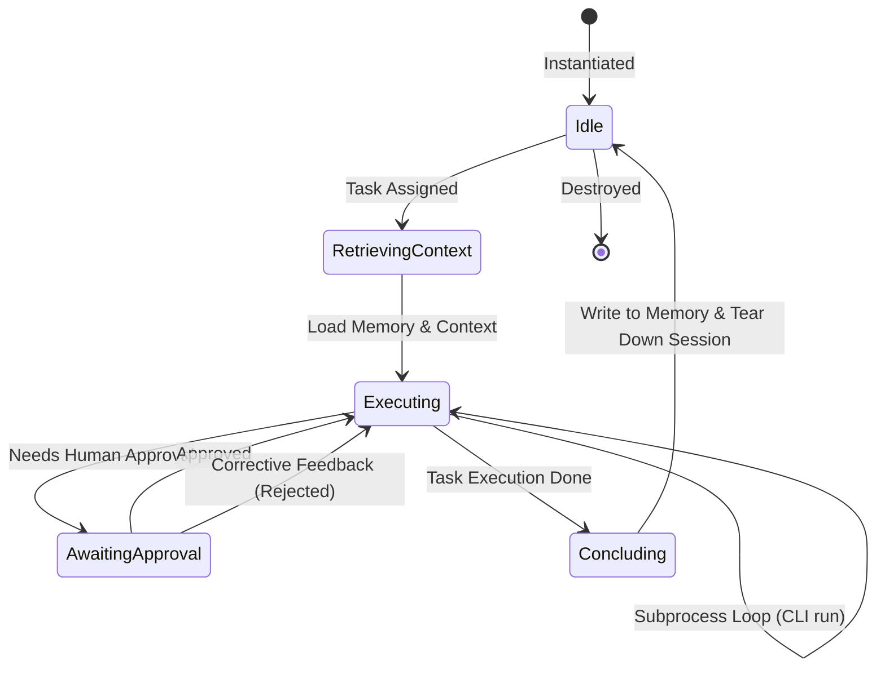

# Local-First AI Software Engineering Platform: Architecture Specification

This document details the architectural design for the provider-agnostic, local-first AI Software Engineering Platform. This platform orchestrates multiple AI coding assistants as a virtual software company, entirely offline and local-first, communicating through their respective command-line interfaces (CLIs).

---

## 1. Folder Structure

```
local-first-se-platform/
├── config/                         # Configuration schemas and default settings
│   └── default.json                # Global default config
├── docs/                           # Documentation
│   └── architecture.md             # This architecture design document
├── src/
│   ├── core/                       # Clean Architecture: Core Domain & Application Rules
│   │   ├── domain/                 # Pure domain models and core interfaces (no dependencies)
│   │   │   ├── models/             # Domain entities (Agent, Job, Task, Event, Message)
│   │   │   └── interfaces/         # Core abstractions (IProvider, IAgent, IMemory, IEventBus)
│   │   └── application/            # Use cases, workflow orchestrators, state machine logic
│   │       ├── state/              # State machine definitions and status tracking
│   │       ├── workflow/           # Workflow engine, DSL parsers, DAG execution
│   │       └── event_bus/          # Event system, event dispatchers, and subscribers
│   ├── infrastructure/             # Clean Architecture: Frameworks, CLI wrappers, DBs
│   │   ├── providers/              # CLI / LLM wrappers (Claude CLI, Gemini CLI, Goose, etc.)
│   │   ├── storage/                # SQLite, local file-system persistence implementations
│   │   ├── memory/                 # Vector index (local SQLite-VSS/ChromaDB), semantic memory
│   │   ├── terminal/               # Interactive bash process manager and sandboxed execution
│   │   ├── git/                    # Git repository manipulation wrapper (branch, commit, diff)
│   │   ├── logging/                # Structured local JSON logging
│   │   └── approval/               # Interactive terminal / web-view human gatekeeper
│   └── main.ts                     # Application entry point, CLI bootstrap, and DI setup
└── tests/                          # Integration and unit test suite
```

---

## 2. Module Boundaries & Explanations

To enforce strong separation of concerns, the system is split into three main concentric layers based on Clean Architecture principles:

### Core Domain (`src/core/domain`)
- **Zero External Dependencies**: Has no dependencies on third-party frameworks, databases, libraries, or network processes.
- **Models**: Defines raw data structures (`Project`, `Task`, `Message`, `ToolResult`, `MemorySnippet`) which represent the core business logic of the platform.
- **Interfaces**: Defines abstractions (`IProvider`, `ISession`, `IConversation`, `IToolExecutor`, `IAgent`, `IMemory`, `IWorkflow`) that establish how agents and providers must behave.

### Core Application (`src/core/application`)
- **Workflow & State Management**: Contains the implementation of the `WorkflowStateMachine`, the DAG Workflow Engine execution parser, and scheduling loops.
- **Event Bus**: Implements the memory-backed `EventBus` to allow loose coupling between independent agents and infrastructure events.
- **Rules of Engagement**: Implements logic governing when tasks transition and when agents are invoked.

### Infrastructure (`src/infrastructure`)
- **Adapters & Wrappers**: Implements all interfaces defined in the domain layer.
- **CLI subprocess interfaces**: Houses the terminal handlers that spawn and manage background child processes (such as the `Claude CLI`, `Codex CLI`, `Gemini CLI`).
- **File System & Persistence**: Connects local SQLite instances and file directories for project workspaces, logs, and long-term vector embeddings.

---

## 3. Clean Architecture Diagram

The circular flow of control and dependency resolution is implemented as follows:

```
+-----------------------------------------------------------------------------+
|                               INFRASTRUCTURE                                |
|   +---------------------------------------------------------------------+   |
|   |                            APPLICATION                              |   |
|   |   +-------------------------------------------------------------+   |   |
|   |   |                           DOMAIN                            |   |   |
|   |   |                                                             |   |   |
|   |   |   Entities:                                                 |   |   |
|   |   |     - Task, Project, Event, Message                         |   |   |
|   |   |                                                             |   |   |
|   |   |   Interfaces:                                               |   |   |
|   |   |     - IProvider, ISession, IAgent, IWorkflow                |   |   |
|   |   +-------------------------------------------------------------+   |   |
|   |                                                                     |   |
|   |   Use Cases / Controls:                                             |   |
|   |     - Workflow Orchestrator (DAG Executor)                          |   |
|   |     - State Machine (Task & Agent States)                           |   |
|   |     - Event Dispatcher / Local PubSub                               |   |
|   +---------------------------------------------------------------------+   |
|                                                                             |
|   Gateways / Adapters / Concrete Implementations:                           |
|     - ClaudeCliProvider, GeminiCliProvider (Subprocesses)                   |
|     - GitClient, TerminalManager                                            |
|     - SQLiteStorage, SQLiteVSSMemory                                        |
|     - CLI / Console IO (Human Approval Gate)                                |
+-----------------------------------------------------------------------------+
```

---

## 4. Interfaces

Every major building block is defined via contract interfaces to support unlimited extension and substitution.

### Provider Abstraction Interfaces

```typescript
export interface IProvider {
  id: string; // e.g. "claude-cli", "gemini-cli"
  name: string;
  capabilities: Capability[];
  
  createSession(projectId: string, sessionId: string): Promise<ISession>;
}

export interface ISession {
  id: string;
  projectId: string;
  providerId: string;
  
  createConversation(): Promise<IConversation>;
  getToolExecutor(): IToolExecutor;
  close(): Promise<void>;
}

export interface IConversation {
  id: string;
  sessionId: string;
  
  // Sends a message to the CLI sub-process and yields incremental output chunks
  sendMessage(prompt: string): AsyncGenerator<string, string, void>;
  getHistory(): Promise<Message[]>;
}

export interface IToolExecutor {
  // Parsers and execution hooks for CLI tool calls (files, shell command intercepts)
  executeTool(toolName: string, args: Record<string, any>): Promise<ToolResult>;
  registerInterceptor(toolName: string, hook: (args: any) => Promise<boolean>): void;
}
```

### Agent & Workflow Interfaces

```typescript
export interface IAgent {
  id: string;
  role: IRole;
  capabilities: Capability[];
  memory: IMemory;
  provider: IProvider;
  
  executeTask(task: Task, context: WorkflowContext): Promise<TaskResult>;
}

export interface IRole {
  name: string; // e.g. "Architect", "QA Engineer"
  systemPromptTemplate: string;
  allowedTools: string[];
}

export interface Capability {
  name: string; // e.g. "git-commit", "run-linter"
  description: string;
  parametersSchema: Record<string, any>;
}

export interface IMemory {
  // Local semantic & episodic memory abstraction
  store(key: string, content: string, tags?: string[]): Promise<void>;
  query(semanticQuery: string, limit?: number): Promise<MemorySnippet[]>;
  clear(): Promise<void>;
}

export interface IWorkflow {
  id: string;
  name: string;
  // DAG of tasks defined in YAML/JSON
  tasks: TaskNode[];
  
  getNextTasks(completedTask: Task, results: Record<string, TaskResult>): TaskNode[];
  isCompleted(results: Record<string, TaskResult>): boolean;
}
```

---

## 5. Domain Models

```typescript
export interface Project {
  id: string;
  name: string;
  rootPath: string;
  createdAt: Date;
}

export interface Task {
  id: string;
  projectId: string;
  workflowId: string;
  title: string;
  description: string;
  assignedAgentId?: string;
  status: TaskStatus;
  dependencies: string[]; // List of task IDs that must complete first
  output?: string;
  createdAt: Date;
  updatedAt: Date;
}

export interface Message {
  id: string;
  conversationId: string;
  sender: 'user' | 'agent' | 'system' | 'tool';
  content: string;
  timestamp: Date;
}

export interface ToolResult {
  toolName: string;
  success: boolean;
  output: string;
  error?: string;
}

export interface MemorySnippet {
  id: string;
  content: string;
  score: number; // Retrieval match score
  timestamp: Date;
}
```

---

## 6. Event System

The platform uses an asynchronous, single-process, memory-backed Event Bus (PubSub pattern) to maintain decoupling. 

### Core Event Structure
```typescript
export interface AppEvent<T = any> {
  id: string;
  type: string; // e.g., "TASK_STARTED", "HUMAN_APPROVAL_REQUESTED"
  payload: T;
  timestamp: Date;
}

export interface IEventBus {
  publish(event: AppEvent): void;
  subscribe(type: string, handler: (event: AppEvent) => void): void;
  unsubscribe(type: string, handler: (event: AppEvent) => void): void;
}
```

### Key Event Types
- `PROJECT_INITIATED`: New project registered.
- `WORKFLOW_STARTED`: Workflow engine triggers a new DAG execution.
- `TASK_STATUS_CHANGED`: Task transitions between states.
- `AGENT_ACTION_REQUESTED`: Agent requests a tools run or approval.
- `HUMAN_DECISION_SUBMITTED`: Human approves or rejects agent action.
- `PROVIDER_SESSION_LOGGED`: CLI input/output activity.

---

## 7. Task Lifecycle

Tasks inside a workflow progress through a strict, deterministic sequence:

```
[Pending] ---> [Ready] ---> [Running] ---> [Approval Required]
                  ^             |                  |
                  |             v                  v
                  +-------- [Failed] <------- [Rejected]
                                |
                                v
                            [Aborted]
```

1. **Pending**: Waiting on dependency tasks.
2. **Ready**: All dependencies resolved; queued for execution.
3. **Running**: Assigned to an agent; provider session executing.
4. **Approval Required**: Waiting for a human decision (e.g. before executing mutating command or writing file).
5. **Completed**: Finished execution successfully.
6. **Failed**: Technical error or unhandled exception during execution.
7. **Rejected**: Rejected by human approval; loops back or transitions to Failed.

---

## 8. Agent Lifecycle

Agents are dynamically instantiated, assigned to tasks, and cleaned up to prevent resource leakage:



---

## 9. State Machine

The workflow runtime runs a centralized State Machine verifying the integrity of the active project graph.

### State Transitions Configuration
```typescript
export class WorkflowStateMachine {
  private currentState: Record<string, TaskStatus> = {};

  transition(taskId: string, action: 'START' | 'COMPLETE' | 'FAIL' | 'GATE_REJECT' | 'REQUIRE_APPROVAL'): TaskStatus {
    const fromStatus = this.currentState[taskId] || 'PENDING';
    let toStatus: TaskStatus = fromStatus;

    switch (fromStatus) {
      case 'PENDING':
        if (action === 'START') toStatus = 'RUNNING';
        break;
      case 'RUNNING':
        if (action === 'COMPLETE') toStatus = 'COMPLETED';
        if (action === 'FAIL') toStatus = 'FAILED';
        if (action === 'REQUIRE_APPROVAL') toStatus = 'APPROVAL_REQUIRED';
        break;
      case 'APPROVAL_REQUIRED':
        if (action === 'START') toStatus = 'RUNNING'; // resumes running
        if (action === 'GATE_REJECT') toStatus = 'FAILED';
        break;
      default:
        throw new Error(`Invalid transition: ${fromStatus} -> ${action}`);
    }

    this.currentState[taskId] = toStatus;
    return toStatus;
  }
}
```

---

## 10. Provider Abstraction (CLI Integration)

Instead of using raw API HTTP requests, each Provider wraps a locally installed CLI utility. This is achieved by spawning a persistent pseudo-terminal (PTY) or process wrapper:

```typescript
export class CLIProviderWrapper implements ISession {
  private childProcess: any; // e.g. node-pty instance or execa child process
  
  constructor(private cliExecutablePath: string, private initialArgs: string[]) {}

  async createConversation(): Promise<IConversation> {
    // Spawns the CLI executable (e.g. `claude` or `gemini`) in interactive mode
    // Sends raw input lines to stdin, monitors stdout/stderr for outputs
    return {
      id: crypto.randomUUID(),
      sessionId: this.id,
      sendMessage: async function* (prompt: string) {
        // 1. Write prompt to subprocess stdin
        // 2. Stream chunk responses from stdout via generator yielding text
        // 3. Detect completion prompt marker (e.g. custom prompt symbol, shell EOF)
      }
    };
  }
  
  getToolExecutor(): IToolExecutor {
    // Intercepts CLI output that looks like markdown codeblocks or shell execution commands
    // and funnels them through the local Human-in-the-loop validation
    return new LocalToolExecutor();
  }

  async close(): Promise<void> {
    if (this.childProcess) {
      this.childProcess.kill();
    }
  }
}
```

---

## 11. Memory Abstraction

Memory is entirely local, combining two strategies:
1. **Episodic memory**: Local text files recording conversation history logs and agent logs.
2. **Semantic memory**: Vector search built directly into the app using a local SQLite instance with an extension like `sqlite-vss`, or a pure-in-memory vector index (like `hnswlib-node`) serialized to disk.

```typescript
export interface MemoryRecord {
  id: string;
  embedding?: number[];
  text: string;
  tags: string[];
  timestamp: number;
}
```

---

## 12. Storage Abstraction

To ensure local-first resilience without running heavy external DB servers, the persistence engine is designed around:
- **SQLite**: Structured relational database storing projects, jobs, workflow states, and logs.
- **Local File System**: Raw file cache, git diff trees, and workspace checkouts.

```typescript
export interface IStorage {
  initialize(): Promise<void>;
  saveProject(project: Project): Promise<void>;
  getProject(id: string): Promise<Project | null>;
  saveTask(task: Task): Promise<void>;
  getTasksForProject(projectId: string): Promise<Task[]>;
  saveMessage(message: Message): Promise<void>;
}
```

---

## 13. Configuration System

Configuration is read from a simple local YAML or JSON file in the project's config directory (e.g. `~/.config/local-first-se/config.json`).
- Environment variables override file-based configurations.
- Custom plugins can register configuration options dynamically.

```typescript
export interface SystemConfig {
  workspaceRoot: string;
  providers: {
    [providerId: string]: {
      enabled: boolean;
      cliPath: string;
      defaultArgs: string[];
    }
  };
  approvalMode: 'interactive' | 'automatic' | 'disabled';
  maxConcurrentAgents: number;
}
```

---

## 14. Logging System

The platform uses a structured, local-first logging module writing JSON lines (`.jsonl`) to a local `.logs/` folder within the active project workspace.
- Logs include correlation IDs (`traceId`, `taskId`, `agentId`) to allow timeline tracing.
- Console outputs use terminal styling but maintain clean file writes.

---

## 15. Workflow Engine

The Workflow Engine compiles a YAML configuration file representing the graph of dependencies into a Directed Acyclic Graph (DAG).

### Example Workflow DSL (YAML Conceptual Model)
```yaml
name: "Feature Implementation Workflow"
tasks:
  - id: "architect-design"
    agent: "Architect"
    description: "Design the component module boundary interfaces"
  - id: "impl-backend"
    agent: "Backend Engineer"
    dependencies: ["architect-design"]
    description: "Write the classes implementing the interfaces"
  - id: "impl-frontend"
    agent: "Frontend Engineer"
    dependencies: ["architect-design"]
    description: "Implement the interactive user interface"
  - id: "qa-verification"
    agent: "QA Engineer"
    dependencies: ["impl-backend", "impl-frontend"]
    description: "Create tests and verify logic"
```

The engine iterates through the DAG, spawning agents as their dependencies complete.

---

## 16. Scheduler

Since the execution is local, the Scheduler is a basic FIFO priority event loop:
- Enqueues ready tasks.
- Respects resource limits (`maxConcurrentAgents`).
- Dispatches tasks to available agent runner instances.

---

## 17. Human Approval System

Every mutating system action (e.g., executing a command on the user terminal, editing a local file, performing a git branch push) requests approval from the local user.

- **Interactive Mode**: Prompts the user directly in the terminal executing the platform.
- **Interruptible State**: The task is placed in `APPROVAL_REQUIRED` state and publishes a `HUMAN_APPROVAL_REQUESTED` event.
- The human can:
  - **Approve**: Action proceeds.
  - **Reject with Feedback**: Action is aborted, user feedback is injected back into the agent conversation as a prompt to let it self-correct.
  - **Modify**: The user modifies the code/command directly and marks it resolved.

---

## 18. Git Integration

The platform manages codebases strictly via a sandboxed local git client wrapper.
- All agent operations are performed on separate auto-generated feature branches (e.g., `ai-feature/architect-design`).
- Agents commit changes step-by-step with structured logs.
- Merges to the local master branch require human approval and successful execution of QA/testing tasks.

---

## 19. Terminal Manager

Commands run by agents (such as running test commands, installing node packages, checking directory listings) must run locally but in a controlled shell environment:
- Spawns command-line shell scripts using subprocesses.
- Implements execution timeouts to prevent hanging processes (e.g., infinite loops in test execution).
- Buffers output to capture logs.

---

## 20. Future Extension Points

The platform is designed to scale:
- **Provider Plugin Register**: To support future CLIs (Aider, Goose, Ollama, etc.), developers drop a TypeScript file into `src/infrastructure/providers/` that implements the `IProvider` interface.
- **Workflow Action Hooks**: Pre-execution and post-execution triggers hooked into the Event Bus.
- **Custom Agent Personas**: Defining new custom roles simply by adding a schema definition configuration to `config/roles/` specifying capabilities and templates.
