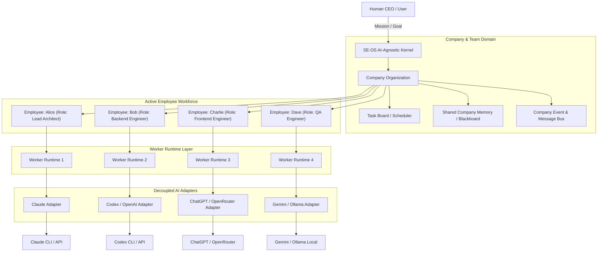
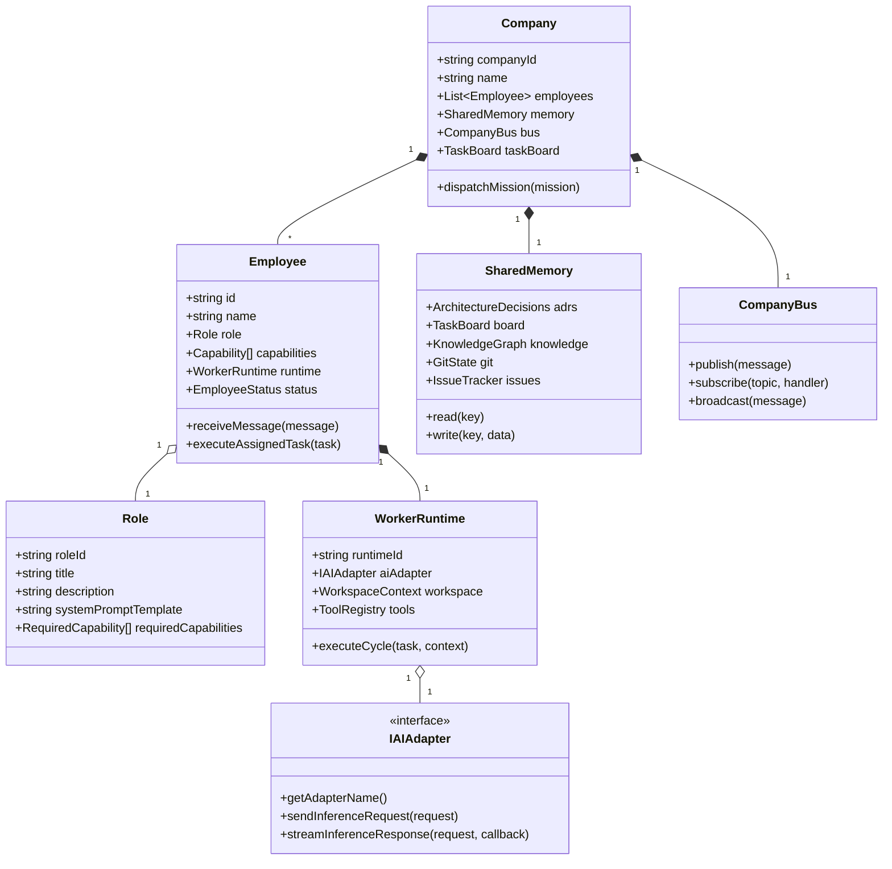
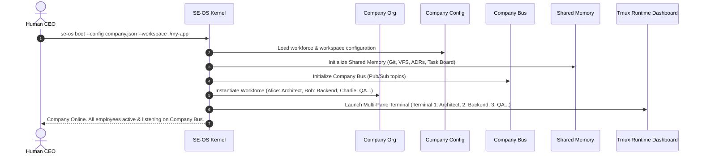
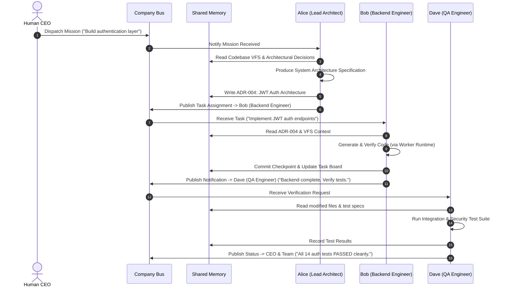

# SE-OS v2.0 Architecture Specification — The AI Software Company Operating System

> **AUTHOR**: Chief Technology Officer (SE-OS Platform Team)  
> **STATUS**: Architecture Reset & Vision Blueprint  
> **SCOPE**: System Domain Model, Multi-Agent Organizational Runtime, AI-Agnostic Kernel, Company Bus & Shared Memory  

---

## 1. Executive Summary & Vision Statement

**SE-OS is an Operating System for an AI Software Engineering Company.**

It is **NOT** a wrapper around any single LLM, **NOT** a Claude CLI automation script, and **NOT** a provider-centric framework.

In SE-OS:
- **The User is the CEO**.
- **Roles are Permanent System Entities** (`Lead Architect`, `Backend Engineer`, `Frontend Engineer`, `QA Engineer`, `Research Engineer`, `DevOps Engineer`).
- **Employees are Operational Workers** (e.g., Alice, Bob, Charlie) assigned to a Role.
- **AI Models are Replaceable Engines** powering individual Workers.
- **The Kernel is 100% AI-Agnostic**: It contains zero vendor-specific prompts, zero LLM-specific parsers, and zero `if (provider === 'Claude')` branching logic.

---

## 2. High-Level Architectural Topology



---

## 3. Core Domain Model & Entity Definitions

### 3.1 Domain Model Diagram



### 3.2 Key Entity Definitions

| Entity | Primary Purpose | Lifecycle & Constraints |
| :--- | :--- | :--- |
| **`Company`** | Top-level organizational container | Holds workforce, shared memory, company bus, and active mission state. |
| **`Role`** | Permanent functional persona definition | Defines role responsibilities, default capabilities, and system prompt templates (e.g. `Backend Engineer`). |
| **`Employee`** | Operational team member instance | Configured with a `Name` (e.g. "Alice"), assigned a `Role`, bound to a `WorkerRuntime` and `AIAdapter`. |
| **`Capability`** | Discrete permission or skill | Granular tags (`CODE_GENERATION`, `REFACTORING`, `AST_ANALYSIS`, `TEST_EXECUTION`, `GIT_CHECKPOINT`, `SECURITY_AUDIT`). |
| **`WorkerRuntime`** | Execution container for an Employee | Handles tool invocation, local workspace isolation, process lifecycle, and context compilation. |
| **`IAIAdapter`** | Decoupled model provider interface | Normalizes communication with external LLM engines (Claude, Codex, ChatGPT, Gemini, DeepSeek, Ollama, etc.). |
| **`CompanyBus`** | Inter-employee pub/sub message broker | Routes direct messages, broadcasts, task delegations, and review feedback between workers. |
| **`SharedMemory`** | Single company blackboard | Universal state holding ADRs, active branches, task dependencies, code knowledge index, and issue trackers. |
| **`Mission`** | High-level CEO objective | Initial prompt or product specification decomposed by the `Lead Architect` and scheduled across the team. |

---

## 4. Startup & Execution Lifecycle

### 4.1 Company Boot Sequence



### 4.2 Mission Dispatch & Team Collaboration Flow



---

## 5. Employee Configuration & AI Adapter Swapping

### 5.1 Declarative Workforce Configuration (`company.json`)

Every employee is declared in a clear, provider-agnostic schema. The AI engine is simply an adapter reference:

```json
{
  "companyName": "Acme AI Software Labs",
  "workspaceRoot": "./projects/e-commerce-api",
  "employees": [
    {
      "id": "emp-001",
      "name": "Alice",
      "role": "LEAD_ARCHITECT",
      "aiAdapter": {
        "provider": "claude",
        "model": "claude-3-7-sonnet",
        "transport": "cli",
        "executable": "claude"
      },
      "capabilities": ["SYSTEM_DESIGN", "ADR_WRITING", "TASK_DECOMPOSITION"],
      "terminalPane": 1
    },
    {
      "id": "emp-002",
      "name": "Bob",
      "role": "BACKEND_ENGINEER",
      "aiAdapter": {
        "provider": "codex",
        "model": "gpt-4o",
        "transport": "openrouter",
        "apiKeyEnv": "OPENROUTER_API_KEY"
      },
      "capabilities": ["CODE_GENERATION", "REFACTORING", "UNIT_TESTING"],
      "terminalPane": 2
    },
    {
      "id": "emp-003",
      "name": "Charlie",
      "role": "QA_ENGINEER",
      "aiAdapter": {
        "provider": "ollama",
        "model": "qwen2.5-coder:32b",
        "transport": "local_rest",
        "endpoint": "http://localhost:11434"
      },
      "capabilities": ["TEST_EXECUTION", "SECURITY_AUDIT", "VALIDATION"],
      "terminalPane": 3
    }
  ]
}
```

### 5.2 Zero-Code AI Adapter Swapping

To swap the AI model for any employee, **zero orchestration code changes are required**.

#### Example: Swapping Bob (Backend Engineer) from Codex to Claude
Change `company.json` from:
```json
"aiAdapter": { "provider": "codex", "model": "gpt-4o" }
```
to:
```json
"aiAdapter": { "provider": "claude", "model": "claude-3-5-sonnet", "transport": "cli" }
```

The `WorkerRuntime`, `Role`, `CompanyBus` subscriptions, `Capabilities`, and `SharedMemory` access remain **100% unchanged**.

---

## 6. Inter-Employee Communication & Shared Memory

### 6.1 Company Message Bus Schema

Messages are structured domain objects passed over the event bus:

```typescript
export type MessageType = 
  | 'TASK_DELEGATION'   // Employee A assigns a sub-task to Employee B
  | 'TASK_COMPLETED'    // Employee B notifies Employee A of task completion
  | 'BROADCAST_ADR'     // Architect broadcasts architectural decision
  | 'REVIEW_REQUEST'    // Engineer requests code review / QA verification
  | 'ISSUE_REPORTED';   // QA reports a failing test or vulnerability

export interface CompanyMessage {
  id: string;
  senderEmployeeId: string;
  recipientEmployeeId?: string; // Omitting recipient = Broadcast to all
  messageType: MessageType;
  topic: string;
  payload: {
    taskId?: string;
    summary: string;
    artifactReferences?: string[];
    data?: Record<string, any>;
  };
  timestamp: string;
}
```

### 6.2 Shared Company Memory (Blackboard Architecture)

There is **one single source of company memory** accessible by all employees:

```typescript
export interface SharedCompanyMemory {
  // Architectural Decisions Record (ADRs)
  architecturalDecisions: ADRRecord[];

  // Global Task Board
  taskBoard: {
    backlog: Task[];
    inProgress: Task[];
    review: Task[];
    completed: Task[];
  };

  // Codebase Virtual File System & AST Knowledge Graph
  knowledgeGraph: {
    symbols: SymbolMap;
    dependencies: DependencyGraph;
    fileIndex: FileKnowledgeMap;
  };

  // Version Control State
  vcsState: {
    currentBranch: string;
    activeCheckpoints: Record<string, string>; // subtaskId -> commitHash
    cleanState: boolean;
  };

  // Issues & Test Results
  issueTracker: {
    openIssues: Issue[];
    resolvedIssues: Issue[];
  };
}
```

---

## 7. How the Kernel Remains 100% AI-Agnostic

To prevent vendor lock-in and vendor drift, the SE-OS Kernel is strictly decoupled from LLM mechanics:

```
[ Kernel Engine ]
       │  (Only knows: Employees, Roles, Tasks, Messages, SharedMemory)
       ▼
[ IAIAdapter Contract ]
  + sendInference(prompt, spec): Promise<NormalizedInferenceResult>
       │
 ┌─────┴───────────────┬──────────────────┬─────────────────┐
 ▼                     ▼                  ▼                 ▼
[ClaudeAdapter]  [CodexAdapter]  [ChatGPTAdapter]  [OllamaAdapter]
 (CLI/SDK)        (OpenRouter)     (REST API)       (Local REST)
```

### The Strict Kernel Constraints:
1. **Zero Provider Conditionals**: `if (provider === 'claude')` is strictly forbidden in core domain/application code.
2. **Normalized Inference Contract**: All adapters return a normalized `NormalizedInferenceResult` containing parsed code blocks, metadata, and token metrics.
3. **No Vendor Prompt Hacks**: Prompt formatting, system tags, and spec wrappers belong to the `AIAdapter` or `Role` templates, not the kernel executor.

---

## 8. Refactoring & Rename Blueprint (v1.x -> v2.0 Transition)

The following components from SE-OS v1.x are renamed and refactored to align with the AI Company Architecture:

| Current Component (v1.x) | New v2.0 Entity | Refactoring & Conceptual Shift |
| :--- | :--- | :--- |
| `TaskExecutionService` | `WorkerRuntime` | Shifted from a monolith execution service to a worker runtime container for an individual Employee. |
| `ClaudeProvider` | `ClaudeAIAdapter` | Moved to `src/infrastructure/adapters/` implementing `IAIAdapter`. |
| `TaskPlanner` | `ArchitectRole` | Task decomposition is now performed by the `Lead Architect` employee using the Company Bus. |
| `ProjectKnowledgeService` | `SharedMemory` | Integrated into the universal company blackboard accessible by all workers. |
| `CliFormatter` / `main.ts` | `TmuxDashboard` | Expanded into multi-pane terminal runtime rendering live panes for each Employee. |
| `EngineeringTask` | `CompanyMission` | Transformed from a raw file task into a company-wide mission assigned to the team. |

---

## 9. Next Steps Blueprint

1. **Domain Models**: Update `src/core/domain/models/company.ts` with `Company`, `Employee`, `Role`, `CompanyMessage`, `SharedMemory`.
2. **AI Adapter Interface**: Define `IAIAdapter` in `src/core/domain/interfaces/iai_adapter.ts`.
3. **Worker Runtime**: Refactor `TaskExecutionService` into `WorkerRuntime`.
4. **Company Bus**: Implement in-memory event bus `CompanyBus` in `src/infrastructure/bus/company_bus.ts`.
5. **Dashboard TUI**: Multi-pane dashboard showing live feeds for Lead Architect, Backend Engineer, QA Engineer.
