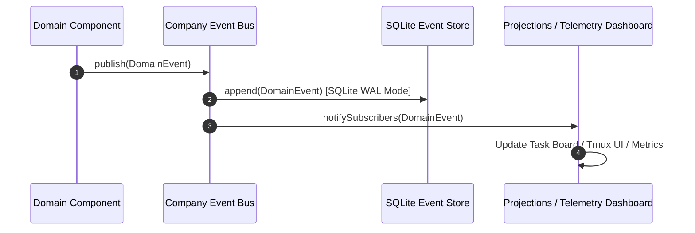

# SE-OS v2.0 — Event System Specification

> **AUTHOR**: Lead Telemetry & Event Architect (SE-OS Platform Team)  
> **STATUS**: Platform Event Architecture Specification  
> **SCOPE**: Event Sourcing Principles, Immutable Domain Event Catalog, Replay Mechanics & SQLite Telemetry Store  

---

## 1. Event Sourcing Core Principles

SE-OS v2.0 is built on **Event Sourcing**:
1. **Immutable Log**: Every state change in the company generates an append-only, immutable domain event.
2. **Auditability**: Complete historical record of every decision, code patch, test run, process crash, and message.
3. **Replayability**: System state can be reconstructed by replaying the event log from offset 0.

---

## 2. Immutable Domain Event Catalog

```typescript
export interface DomainEvent<T = any> {
  eventId: string;                   // UUID v4
  aggregateId: string;               // e.g. missionId, taskId, employeeId
  eventType: EventType;
  version: number;                   // Schema version
  timestamp: string;                 // ISO 8601 UTC
  actorId: string;                   // e.g. "emp-alice" or "CEO"
  payload: T;
}

export type EventType =
  // Company Lifecycle Events
  | 'CompanyBooted'
  | 'CompanyShutdown'
  
  // Mission Events
  | 'MissionCreated'
  | 'MissionStarted'
  | 'MissionCompleted'
  | 'MissionFailed'

  // Task & Scheduling Events
  | 'TaskCreated'
  | 'TaskScheduled'
  | 'TaskAssigned'
  | 'TaskStarted'
  | 'TaskCompleted'
  | 'TaskFailed'
  | 'TaskRetried'

  // Worker Process Events
  | 'WorkerSpawned'
  | 'WorkerCrashed'
  | 'WorkerRestarted'
  | 'WorkerDrained'

  // Collaboration & QA Events
  | 'ReviewRequested'
  | 'ReviewApproved'
  | 'QAAssertionPassed'
  | 'QAAssertionFailed'

  // Plugin Events
  | 'PluginLoaded'
  | 'PluginUnloaded'
  | 'AdapterSwapped';
```

---

## 3. Event Storage & Replay Mechanics



- **Persistence**: Event log stored in SQLite `domain_events` table using Write-Ahead Logging (WAL).
- **Replay**: `IEventStore.replayAll()` allows rebuilding company shared memory state from event history during boot or recovery.
