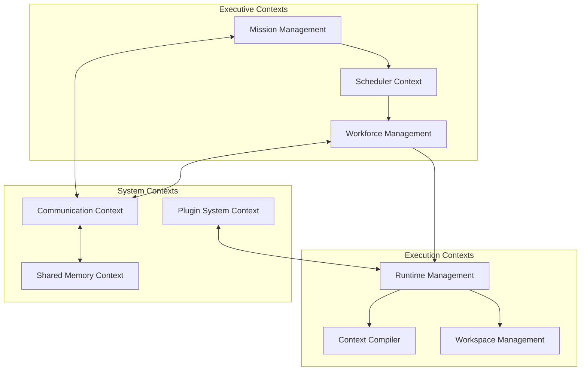

# SE-OS v2.0 — Kernel Domain Specification

> **AUTHOR**: Principal Systems Architect (SE-OS Platform Team)  
> **STATUS**: Platform Kernel Architecture Specification  
> **SCOPE**: Bounded Contexts, Domain-Driven Design, Core Entities, Kernel Contracts, Observability & Future Extensibility  

---

## 1. Domain-Driven Design & Bounded Contexts

SE-OS v2.0 is structured into **9 Bounded Contexts**, establishing strict domain boundaries across the platform:



---

### 1.1 Mission Management Context
- **Responsibilities**: Ingests CEO prompts, manages mission state transitions, tracks high-level milestone progress, and emits final completion reports.
- **Aggregate Root**: `CompanyMission`
- **Entities**: `Milestone`, `GoalRequirement`
- **Value Objects**: `MissionId`, `MissionPriority`, `MissionStatus` (`CREATED`, `ANALYSIS`, `IN_PROGRESS`, `COMPLETED`, `FAILED`)
- **Domain Services**: `MissionPlannerService`, `RiskAssessmentService`
- **Domain Events**: `MissionCreatedEvent`, `MissionStartedEvent`, `MissionCompletedEvent`

---

### 1.2 Workforce Management Context
- **Responsibilities**: Manages Employee directory, roles, capabilities, department assignments, performance telemetry, and organizational hierarchy.
- **Aggregate Root**: `Employee`
- **Entities**: `Role`, `Department`, `Squad`
- **Value Objects**: `EmployeeId`, `SeniorityLevel`, `CapabilityTag`, `PerformanceMetrics`
- **Domain Services**: `WorkforceRosterService`, `CapabilityMatcherService`
- **Domain Events**: `EmployeeRegisteredEvent`, `EmployeePromotedEvent`, `CapabilityGrantedEvent`

---

### 1.3 Runtime Management Context
- **Responsibilities**: Manages local OS child processes, PTY pseudo-terminals, process handles, signal lifecycle (`SIGTERM`/`SIGKILL`), and engine adapter bindings.
- **Aggregate Root**: `WorkerRuntimeHandle`
- **Entities**: `ProcessHandle`, `PTYSession`, `EngineBinding`
- **Value Objects**: `ProcessId`, `ProcessState` (`SPAWNING`, `RUNNING`, `CRASHED`, `DRAINING`), `ResourceCap`
- **Domain Services**: `ProcessSupervisorService`, `HealthCheckerService`
- **Domain Events**: `WorkerSpawnedEvent`, `WorkerCrashedEvent`, `WorkerRestartedEvent`

---

### 1.4 Scheduler Context
- **Responsibilities**: Maintains task dependency DAGs, manages priority queues, schedules tasks across available workers, handles task stealing and retries.
- **Aggregate Root**: `ScheduleQueue`
- **Entities**: `ScheduledTask`, `WorkerSlot`
- **Value Objects**: `TaskId`, `TaskPriority`, `DependencyNode`, `AffinityRule`
- **Domain Services**: `DAGSchedulerService`, `TaskStealingService`
- **Domain Events**: `TaskScheduledEvent`, `TaskDispatchedEvent`, `TaskPreemptedEvent`

---

### 1.5 Shared Memory Context
- **Responsibilities**: Single source of truth (Blackboard) holding Architecture Decision Records (ADRs), Task Board, AST Symbol Index, and VCS state.
- **Aggregate Root**: `SharedCompanyBlackboard`
- **Entities**: `ADRRecord`, `TaskBoardEntry`, `SymbolIndex`
- **Value Objects**: `ADRId`, `CommitHash`, `IssueRef`
- **Domain Services**: `BlackboardPersistenceService`, `ASTGraphIndexerService`
- **Domain Events**: `ADRPublishedEvent`, `SymbolIndexUpdatedEvent`, `GitCheckpointCreatedEvent`

---

### 1.6 Communication Context
- **Responsibilities**: Manages IPC channels, message schema validation, topic routing, broadcast subscriptions, and message history archives.
- **Aggregate Root**: `CompanyMessageBus`
- **Entities**: `MessageChannel`, `SubscriptionTopic`
- **Value Objects**: `MessageId`, `MessageType`, `MessagePayload`
- **Domain Services**: `TopicRouterService`, `IPCProtocolCodec`
- **Domain Events**: `MessagePublishedEvent`, `BroadcastEmittedEvent`

---

### 1.7 Plugin System Context
- **Responsibilities**: Manages third-party plugin discovery, version compatibility verification, dynamic hot-loading, sandbox isolation, and event hooks.
- **Aggregate Root**: `PluginRegistry`
- **Entities**: `PluginManifest`, `RuntimePlugin`
- **Value Objects**: `PluginId`, `SemanticVersion`, `PluginCapability`
- **Domain Services**: `PluginLoaderService`, `PluginSandboxService`
- **Domain Events**: `PluginLoadedEvent`, `PluginUnloadedEvent`, `PluginErrorEvent`

---

### 1.8 Workspace Management Context
- **Responsibilities**: Manages local workspace isolation (Git Worktrees), private scratch directories, atomic file locks, and clean working tree checks.
- **Aggregate Root**: `WorkspaceManager`
- **Entities**: `GitWorktreeHandle`, `ScratchDirectory`
- **Value Objects**: `WorkspacePath`, `LockToken`
- **Domain Services**: `WorktreeManagerService`, `FileLockingService`
- **Domain Events**: `WorktreeCreatedEvent`, `WorktreePrunedEvent`, `FileLockedEvent`

---

### 1.9 Context Compiler Context
- **Responsibilities**: Analyzes task description, performs AST slicing, resolves transitive dependencies, compiles minimal code context slices matching token budgets.
- **Aggregate Root**: `ContextSlice`
- **Entities**: `ASTSlice`, `SymbolDependency`
- **Value Objects**: `ContextTokenSize`, `CodeSliceRange`
- **Domain Services**: `TreeSitterSlicerService`, `DependencyResolverService`
- **Domain Events**: `ContextCompiledEvent`, `ContextCacheHitEvent`

---

## 2. Kernel Public Contracts (TypeScript Interfaces)

```typescript
// ── Core Kernel Entry Point ─────────────────────────────────────────────
export interface IKernel {
  boot(configPath: string): Promise<void>;
  shutdown(signal?: string): Promise<void>;
  getSharedMemory(): ISharedMemory;
  getCompanyBus(): ICompanyBus;
  getScheduler(): IScheduler;
  getPluginRegistry(): IPluginRegistry;
}

// ── Worker Runtime Contract ─────────────────────────────────────────────
export interface IWorkerRuntime {
  employeeId: string;
  pid: number;
  state: 'SPAWNING' | 'RUNNING' | 'CRASHED' | 'DRAINING';
  spawn(engineBinding: EngineBinding): Promise<void>;
  executeTaskCycle(task: ScheduledTask, contextSlice: ContextSlice): Promise<ExecutionCycleResult>;
  stop(signal?: string): Promise<void>;
  getMetrics(): ProcessMetrics;
}

// ── Scheduler Contract ──────────────────────────────────────────────────
export interface IScheduler {
  enqueueTask(task: ScheduledTask): Promise<void>;
  getNextTaskForWorker(employeeId: string, capabilities: string[]): Promise<ScheduledTask | null>;
  markTaskComplete(taskId: string, result: TaskExecutionSummary): Promise<void>;
  markTaskFailed(taskId: string, error: string): Promise<void>;
  getQueueMetrics(): QueueMetrics;
}

// ── Company Bus Contract ────────────────────────────────────────────────
export interface ICompanyBus {
  publish(message: CompanyMessage): Promise<void>;
  subscribe(topic: string, handler: (msg: CompanyMessage) => void): SubscriptionToken;
  unsubscribe(token: SubscriptionToken): void;
  broadcast(message: CompanyMessage): Promise<void>;
}

// ── Shared Memory Contract ──────────────────────────────────────────────
export interface ISharedMemory {
  readADR(adrId: string): Promise<ADRRecord | null>;
  writeADR(adr: ADRRecord): Promise<void>;
  getTaskBoard(): Promise<TaskBoardState>;
  getSymbolGraph(): Promise<SymbolGraph>;
  getGitStatus(): Promise<GitState>;
  writeGitCheckpoint(subTaskId: string, message: string): Promise<string>;
}

// ── Context Compiler Contract ───────────────────────────────────────────
export interface IContextCompiler {
  compileContext(taskPrompt: string, targetFile: string, maxTokens: number): Promise<ContextSlice>;
  invalidateCache(filePath: string): void;
}

// ── Runtime Plugin Contract ─────────────────────────────────────────────
export interface IRuntimePlugin {
  manifest: PluginManifest;
  onLoad(kernel: IKernel): Promise<void>;
  onUnload(): Promise<void>;
  registerCapabilities(): CapabilityTag[];
}

// ── Event Store Contract ────────────────────────────────────────────────
export interface IEventStore {
  append(event: DomainEvent): Promise<void>;
  readStream(aggregateId: string): Promise<DomainEvent[]>;
  replayAll(handler: (event: DomainEvent) => void): Promise<void>;
}
```

---

## 3. Observability Architecture & Metrics Engine

The Kernel's **Observability Engine** aggregates process telemetry into real-time metrics:

| Metric Category | Metric Name | Sampling Interval | Alert Condition |
| :--- | :--- | :--- | :--- |
| **Process CPU** | `process_cpu_percent` | 2,000 ms | Exceeds 90% for > 30s |
| **Process RAM** | `process_memory_rss_bytes` | 2,000 ms | Exceeds 4 GB per worker |
| **Token Usage** | `tokens_consumed_total` | Per Inference | Exceeds assigned task quota |
| **Execution Duration** | `task_duration_ms` | Per Task | Exceeds 120,000 ms |
| **Worker Health** | `worker_heartbeat_timestamp` | 5,000 ms | Missed 3 consecutive heartbeats |
| **Queue Depth** | `scheduler_queue_depth` | 1,000 ms | Exceeds 100 pending tasks |
| **Verification Pass Rate**| `verification_first_pass_ratio` | Rolling 24h | Drops below 80% |

---

## 4. Future Plugin Extension Points

SE-OS v2.0 supports optional third-party integration plugins:

```
[ SE-OS Kernel Plugin Bus ]
        ├── GitIntegrations (GitHub, GitLab, Gitea)
        ├── ProjectManagement (Linear, Jira, Trello)
        ├── ChatOps (Slack, Discord, Teams)
        ├── ProtocolAdapters (MCP Servers, REST Webhooks)
        ├── SandboxRuntimes (Docker, Podman, Firecracker)
        └── CloudProviders (AWS, GCP, Azure, OpenRouter)
```
