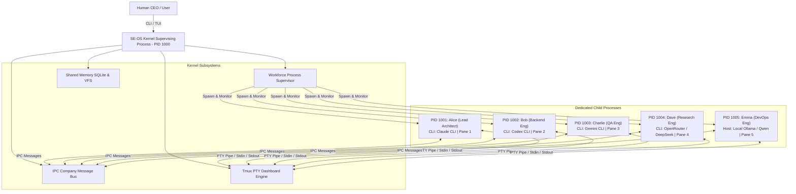
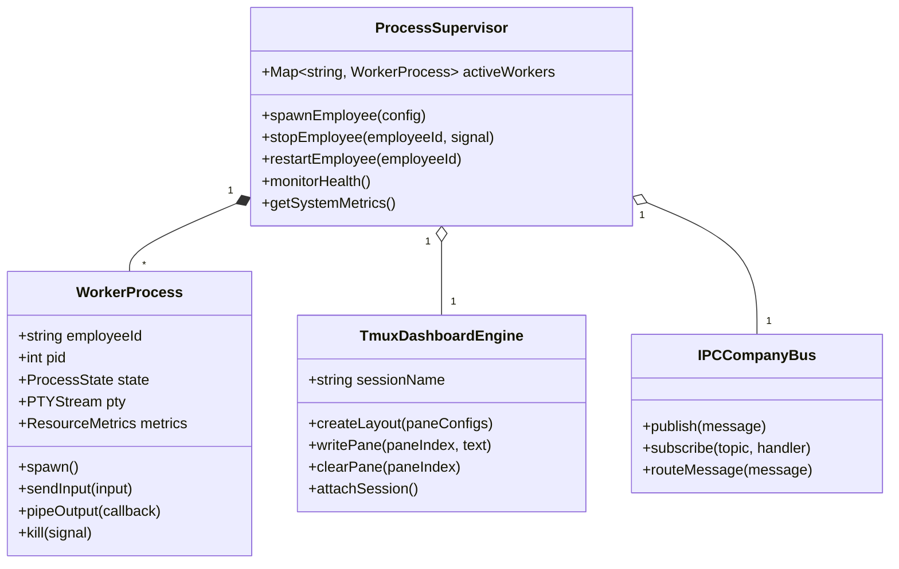
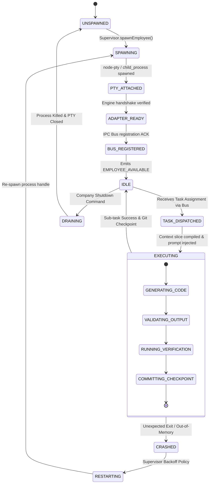

# SE-OS v2.0 — Local Workforce Runtime Architecture Specification

> **AUTHOR**: Chief Technology Officer (SE-OS Platform Team)  
> **STATUS**: Platform Kernel Architecture Specification  
> **SCOPE**: Local Process Supervision, PTY Pseudo-Terminal Piping, Tmux Dashboard Engine, Inter-Process Communication (IPC) Company Bus, Process Health Monitoring & Offline Runtime Models  

---

## 1. Executive Vision & Core Philosophy

**SE-OS is a Local-First Operating System for an AI Software Company.**

It is **NOT** a cloud API wrapper, **NOT** an Anthropic/OpenAI SDK abstraction, and **NOT** a stateless function caller.

### Fundamental Operating System Principles:
1. **Employees are Real Local OS Processes**: Every worker (Alice, Bob, Charlie, Dave, Emma) runs as a dedicated child process with its own PID, PTY terminal, environment variables, working directory, and resource limits.
2. **Terminal-First Transparency**: Every employee owns a dedicated `tmux` pane. The CEO (user) can watch every employee think, stream tokens, execute tools, and inspect files in real time.
3. **The Kernel as a Workforce Supervisor**: The SE-OS Kernel acts as **"Kubernetes for AI Employees on a Single Developer Workstation"**. It handles process spawning, PTY stream piping, crash recovery, resource monitoring (CPU, RAM, token budgets), and IPC routing.
4. **Zero Vendor Coupling**: The AI engine is merely an interchangeable brain powering the local process. Swapping an employee from `claude-cli` to `ollama/qwen` or `codex-cli` changes zero Kernel orchestration logic.
5. **100% Offline Capability**: When configured with local engines (e.g. Ollama, LM Studio, local CLIs), the entire AI software company operates completely offline without internet connectivity.

---

## 2. High-Level Process Architecture



---

## 3. Declarative Workforce Configuration (`company.yaml`)

The CEO configures the local company workforce in a declarative YAML manifest. The Kernel parses `company.yaml` at boot and automatically provisions the local processes, PTY streams, and tmux dashboard layout.

```yaml
version: "2.0"
company:
  name: "Local-First Software Labs"
  workspaceRoot: "./projects/ecommerce-api"
  tmuxSessionName: "se-os-company"
  persistence:
    databasePath: "./se_company.db"
    enableGitCheckpoints: true

# Shared Company Resource Limits
resourceLimits:
  maxTotalMemoryMb: 16384
  maxTotalCpuPercent: 800
  defaultTokenBudget: 100000

# Employees Workforce Manifest
employees:
  - id: "emp-001"
    name: "Alice"
    role: "Lead Architect"
    department: "Architecture"
    engine:
      type: "claude-cli"
      executable: "claude"
      args: ["-p", "--dangerously-skip-permissions"]
      environment:
        ANTHROPIC_API_KEY: "${ANTHROPIC_API_KEY}"
    capabilities:
      - "SYSTEM_DESIGN"
      - "ADR_WRITING"
      - "TASK_DECOMPOSITION"
    tmux:
      paneIndex: 1
      title: "Terminal 1: Alice (Lead Architect - Claude)"

  - id: "emp-002"
    name: "Bob"
    role: "Backend Engineer"
    department: "Backend Engineering"
    engine:
      type: "codex-cli"
      executable: "codex"
      args: ["--non-interactive"]
      environment:
        OPENAI_API_KEY: "${OPENAI_API_KEY}"
    capabilities:
      - "CODE_GENERATION"
      - "REFACTORING"
      - "UNIT_TESTING"
    tmux:
      paneIndex: 2
      title: "Terminal 2: Bob (Backend Engineer - Codex)"

  - id: "emp-003"
    name: "Charlie"
    role: "QA Engineer"
    department: "Quality Assurance"
    engine:
      type: "gemini-cli"
      executable: "gemini"
      args: ["--mode", "developer"]
      environment:
        GEMINI_API_KEY: "${GEMINI_API_KEY}"
    capabilities:
      - "TEST_EXECUTION"
      - "INTEGRATION_TESTING"
      - "VALIDATION"
    tmux:
      paneIndex: 3
      title: "Terminal 3: Charlie (QA Engineer - Gemini)"

  - id: "emp-004"
    name: "Dave"
    role: "Research Engineer"
    department: "Research & Optimization"
    engine:
      type: "openrouter-api"
      endpoint: "https://openrouter.ai/api/v1"
      model: "deepseek/deepseek-r1"
      environment:
        OPENROUTER_API_KEY: "${OPENROUTER_API_KEY}"
    capabilities:
      - "ALGORITHM_RESEARCH"
      - "BENCHMARKING"
    tmux:
      paneIndex: 4
      title: "Terminal 4: Dave (Research Eng - DeepSeek)"

  - id: "emp-005"
    name: "Emma"
    role: "DevOps Engineer"
    department: "DevOps & Infrastructure"
    engine:
      type: "ollama-local"
      endpoint: "http://localhost:11434"
      model: "qwen2.5-coder:32b"
      offlineMode: true
    capabilities:
      - "DOCKER_BUILD"
      - "CI_CD_PIPELINE"
      - "DEVOPS"
    tmux:
      paneIndex: 5
      title: "Terminal 5: Emma (DevOps Eng - Local Ollama)"
```

---

## 4. Local Process Supervision Kernel

The **Workforce Process Supervisor** manages the operational lifecycle of every child process on the local workstation.



### 4.1 Supervisor Responsibilities
1. **Process Lifecycle Management**: Spawns binaries via Node `child_process.spawn()` or `node-pty`, attaches PTY handles, monitors exit codes, handles signals (`SIGTERM`, `SIGKILL`).
2. **PTY Pseudo-Terminal Piping**: Pipes raw unbuffered `stdout` and `stderr` streams directly into assigned `tmux` panes while capturing telemetry logs in parallel.
3. **Local Resource Limits**: Monitors memory (RSS/Heap) and CPU usage per PID via native OS `/proc` or `ps` interfaces. Enforces emergency memory caps (e.g. restarts a worker exceeding 4GB RAM).
4. **Crash Recovery & Supervision**: Implements an **Exponential Backoff Supervisor Policy** for unexpected process exits:
   - Attempt 1: Immediate restart (0s delay).
   - Attempt 2: Restart after 2s delay.
   - Attempt 3: Restart after 10s delay.
   - Attempt 4: Trigger **Circuit Breaker** → Emit emergency alert to Manager and pause task.

---

## 5. Tmux Dashboard & Terminal Layout Specification

The default local interface is a live multi-pane `tmux` dashboard session (`se-os-company`).

### 5.1 Tmux Grid Architecture

```
┌────────────────────────────────────────────────────────────────────────┐
│                        SE-OS CEO CONSOLE (PANE 0)                      │
│ Mission: "Implement authentication layer with JWT & Redis session"     │
│ Active Squads: 3 | Running Workers: 5 | Total Tokens: 42.8k | Status: OK │
├───────────────────────────────────┬────────────────────────────────────┤
│ Terminal 1: Alice                 │ Terminal 2: Bob                    │
│ Role: Lead Architect (Claude CLI) │ Role: Backend Engineer (Codex CLI) │
│ > Generating ADR-002...           │ > Implementing src/auth/jwt.ts...  │
├───────────────────────────────────┼────────────────────────────────────┤
│ Terminal 3: Charlie               │ Terminal 4: Dave                   │
│ Role: QA Engineer (Gemini CLI)    │ Role: Research Eng (DeepSeek)      │
│ > Running tests/auth.test.ts...   │ > Benchmarking argon2 vs bcrypt... │
├───────────────────────────────────┴────────────────────────────────────┤
│ Terminal 5: Emma                                                       │
│ Role: DevOps Engineer (Local Ollama / Qwen2.5-Coder)                   │
│ > Verifying Docker container build and healthcheck...                 │
└────────────────────────────────────────────────────────────────────────┘
```

### 5.2 Terminal Persistence & Live Inspection
- **Live Watching**: The CEO can watch all 5 workers collaborate live on screen.
- **Background Detach**: The user can detach from tmux anytime (`Ctrl-B d`). The Kernel continues orchestrating background worker processes seamlessly.
- **Reattach**: The user can reattach at any point to inspect real-time progress:
  ```bash
  tmux attach -t se-os-company
  ```

---

## 6. Process Lifecycle State Machine

Each local worker process transitions through a strict, deterministic state machine:



---

## 7. Inter-Process Communication (IPC) Company Bus

Workers **never** make direct peer-to-peer process connections. All inter-worker messages pass through the Kernel's IPC Company Bus.

```
[ Worker Process: Bob (PID 1002) ]
         │
         │ (Writes IPC JSON payload to stdout or Unix Domain Socket)
         ▼
[ SE-OS Kernel IPC Bus (PID 1000) ]
         │
         ├── 1. Validates Message Schema & Sender Permissions
         ├── 2. Logs Message to Shared Memory (SQLite / Message Store)
         └── 3. Routes Payload to Recipient Topic
         │
         ▼
[ Worker Process: Charlie (PID 1003) ]
```

### 7.1 IPC Transport Layer Options
Depending on the engine type, the Kernel supports three zero-dependency local IPC transports:

1. **Unix Domain Sockets (`/tmp/se-os-bus.sock`)**: High-performance, binary-safe IPC for local node runtimes and custom CLI wrappers.
2. **Piped Stdin/Stdout Stream Filters**: For CLI engines (`claude`, `codex`, `gemini`), the Kernel writes structured prompt wrappers to `stdin` and parses JSON message frames from `stdout`.
3. **Local REST API Loopback (`http://127.0.0.1:8765`)**: For local model servers (`Ollama`, `LM Studio`), the Kernel provides a lightweight local HTTP loopback server.

---

## 8. Offline & Local Model Capabilities

SE-OS guarantees **100% offline development** when using local model hosts like **Ollama** or **LM Studio**.

### Local Model Support Specs:
- **Zero Internet Requirement**: Code generation, AST context compilation, unit test verification, and git checkpointing run entirely on local CPU/GPU hardware.
- **Engine Protocol Neutrality**:
  - `ollama`: Interfaces with local GGUF models (`qwen2.5-coder`, `deepseek-r1`, `llama3.3`).
  - `lm-studio`: Interfaces with local OpenAI-compatible REST endpoints (`http://localhost:1234/v1`).
  - `custom-binary`: Interfaces with any local executable accepting stdin prompts.

---

## 9. Failure Supervision & Health Monitoring

The Kernel's **Health Monitor** continuously polls local worker processes:

```typescript
export interface ProcessHealthStatus {
  employeeId: string;
  pid: number;
  isAlive: boolean;
  cpuPercent: number;
  memoryRssMb: number;
  uptimeSeconds: number;
  lastHeartbeatTimestamp: number;
  consecutiveFailures: number;
  circuitBreakerTripped: boolean;
}
```

### Heartbeat & Deadlock Detection:
- **Heartbeat Interval**: 5,000 ms.
- **Unresponsive Threshold**: 30,000 ms without stdout activity during an active execution cycle triggers a **Hanging Process Warning**.
- **Process Termination**: If a worker process hangs for > 120s without progress, the Supervisor issues `SIGTERM`, waits 5s, then issues `SIGKILL` and initiates an automated process restart.

---

## 10. Architectural Comparison: v1.x vs v2.0 Local Runtime

| Dimension | SE-OS v1.x | SE-OS v2.0 Local Workforce Runtime |
| :--- | :--- | :--- |
| **Execution Model** | Single Node process executing sequential helper functions | **Multi-process local operating system** supervising PIDs |
| **Worker Identity** | Hardcoded AI provider string | **Dedicated local child process** with PID, PTY, and log stream |
| **Terminal Integration** | Basic stdout console output | **Automated multi-pane `tmux` grid** (`se-os-company`) |
| **Process Supervision** | Basic try/catch around `exec()` | **Process Supervisor** with auto-restart, PTY piping & health metrics |
| **IPC Infrastructure** | In-memory function arguments | **Structured IPC Company Bus** (Unix Sockets / Stream Filters) |
| **Model Coupling** | Claude-centric execution rules | **100% Engine Agnostic** (Claude, Codex, Gemini, Ollama, LM Studio) |
| **Offline Capability** | Limited | **100% Offline Capable** via local Ollama / GGUF model hosts |
