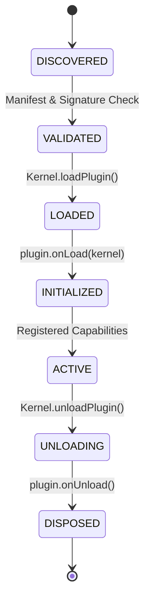

# SE-OS v2.0 — Runtime Plugin SDK Specification

> **AUTHOR**: Lead Framework Engineer (SE-OS Platform Team)  
> **STATUS**: Platform Plugin Architecture Specification  
> **SCOPE**: Plugin Lifecycle, Manifest Schema, Registration, Hot Loading/Unloading, Capabilities & Directory Layout  

---

## 1. Plugin Directory Architecture

Every third-party worker runtime engine is packaged as an isolated plugin directory under `plugins/`:

```
plugins/
├── claude-cli/
│   ├── plugin.json           # Manifest & Engine Config
│   ├── index.js              # Plugin Entry Point
│   └── README.md
├── codex-cli/
│   ├── plugin.json
│   └── index.js
├── ollama/
│   ├── plugin.json
│   └── index.js
├── chatgpt-cli/
│   ├── plugin.json
│   └── index.js
├── gemini/
│   ├── plugin.json
│   └── index.js
└── custom-runtime/
    ├── plugin.json
    └── index.js
```

---

## 2. Plugin Manifest Schema (`plugin.json`)

```json
{
  "id": "plugin-claude-cli",
  "name": "Claude CLI Engine Adapter",
  "version": "2.0.0",
  "description": "Local process adapter for Anthropic Claude CLI executable",
  "author": "SE-OS Team",
  "license": "MIT",
  "minKernelVersion": "2.0.0",
  "entryPoint": "index.js",
  "engineType": "cli",
  "executable": "claude",
  "defaultArgs": ["-p", "--dangerously-skip-permissions"],
  "capabilities": [
    "CODE_GENERATION",
    "REFACTORING",
    "AST_ANALYSIS",
    "SYSTEM_DESIGN"
  ],
  "supportedEnvironments": ["darwin", "linux", "win32"],
  "offlineSupported": false
}
```

---

## 3. Plugin Lifecycle State Machine



### 3.1 Lifecycle Methods Interface

```typescript
export interface IRuntimePluginSDK {
  manifest: PluginManifest;
  
  /** Called when the plugin is dynamically loaded by the Kernel. */
  onLoad(kernel: IKernelContext): Promise<void>;
  
  /** Spawns a worker process configured with this plugin's engine. */
  spawnWorkerProcess(config: WorkerProcessConfig): Promise<IWorkerProcessHandle>;
  
  /** Called when the plugin is hot-unloaded or disabled by the CEO. */
  onUnload(): Promise<void>;
}
```

---

## 4. Hot Loading & Unloading Mechanics

1. **Hot Loading**:
   - The Kernel watches `plugins/` directory via FS events.
   - When a new plugin folder is dropped, the Kernel validates `plugin.json`, checks `minKernelVersion`, imports `entryPoint` dynamically, calls `onLoad(kernel)`, and registers its engine adapter.
2. **Hot Unloading**:
   - When a plugin is deleted or disabled, the Kernel invokes `onUnload()`, drains active worker processes associated with that plugin, unsubscribes its event handlers, and purges its module cache.

---

## 5. Security & Isolation Model

- **No Privilege Escalation**: Plugins run inside sandboxed Node VM contexts or isolated worker processes.
- **Explicit Capability Declaration**: Plugins must explicitly state required capabilities in `plugin.json`.
- **Resource Enforcement**: Process supervisor applies strict memory and execution duration caps on child processes spawned by plugins.
