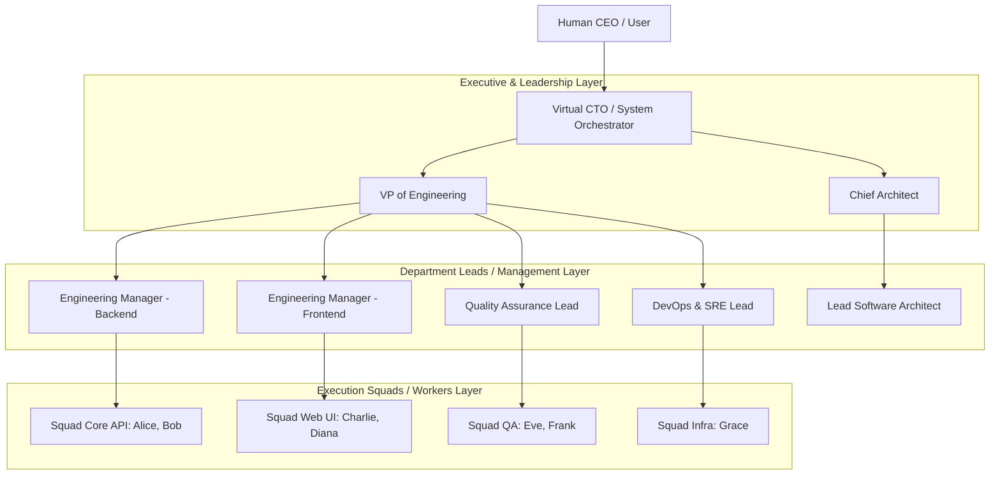
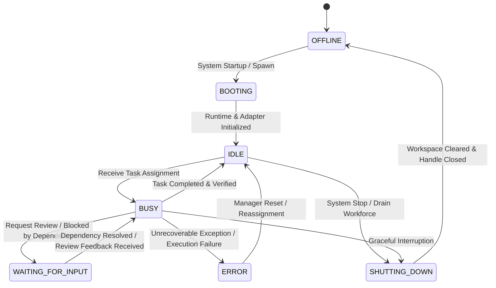
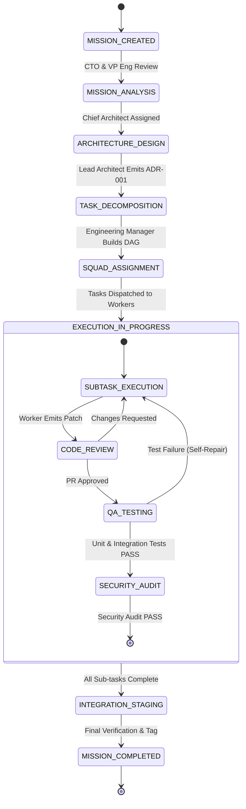
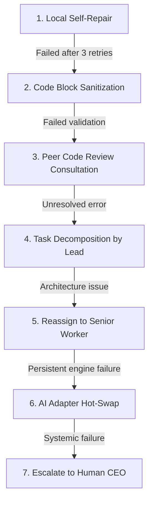

# SE-OS v2.0 — Workforce Operating Model Specification

> **AUTHOR**: Chief Technology Officer (SE-OS Platform Team)  
> **STATUS**: Organizational Architecture Blueprint  
> **SCOPE**: Company Hierarchy, Employee Lifecycle, Mission State Machine, Structured Communication, Shared Memory Partitioning, Escalation Protocols & Mass Scale Topology  

---

## 1. Company Hierarchy & Organizational Structure

### 1.1 Hierarchical vs. Flat Design Decision

SE-OS adopts a **Hybrid Hierarchical-Squad Structure** rather than a completely flat topology.

#### Why a Pure Flat Structure Fails at Scale:
- **Communication Overhead**: $N(N-1)/2$ communication channels explode. 50 flat agents generate 1,225 channels; 500 agents generate 124,750 channels.
- **Context Flooding**: Every worker is forced to process all company noise.
- **Decisional Paralysis**: Without clear escalation paths, consensus-seeking stalls mission execution.

#### The SE-OS Hybrid Hierarchical-Squad Topology:



### 1.2 Structural Rules
1. **Executive Layer (CTO / VP / Chief Architect)**: Translates CEO intent into architectural missions, establishes engineering standards, enforces quality gates.
2. **Management Layer (Engineering Managers & Leads)**: Manages capacity, decomposes missions into sub-task DAGs, assigns ownership, monitors velocity.
3. **Engineering Layer (Squad Workers)**: Atomic execution units (Backend, Frontend, QA, Infra, Research) executing tasks within isolated working scopes.
4. **Strict Span of Control**: Maximum of 5–7 workers per Squad Lead to guarantee token-efficient communication.

---

## 2. Employee Identity & Domain Model

An Employee is an autonomous operational agent defined by much more than an API key or adapter name.

### 2.1 Complete Employee Schema

```typescript
export type DepartmentType = 
  | 'EXECUTIVE'
  | 'ARCHITECTURE'
  | 'BACKEND_ENGINEERING'
  | 'FRONTEND_ENGINEERING'
  | 'QUALITY_ASSURANCE'
  | 'SECURITY_COMPLIANCE'
  | 'DEVOPS_SRE'
  | 'RESEARCH_OPTIMIZATION'
  | 'TECHNICAL_WRITING';

export type EmployeeSeniority = 'JUNIOR' | 'MID' | 'SENIOR' | 'LEAD' | 'EXECUTIVE';

export interface EmployeeIdentity {
  // Metadata
  id: string;                         // e.g. "emp-backend-002"
  name: string;                       // e.g. "Bob"
  title: string;                      // e.g. "Senior Backend Engineer"
  department: DepartmentType;
  seniority: EmployeeSeniority;
  supervisorId?: string;              // e.g. "emp-mgr-backend"

  // Persona & Operational Trait Configuration
  traits: {
    personality: string;              // e.g. "Meticulous, safety-focused, DRY practitioner"
    communicationStyle: string;       // e.g. "Concise, Markdown bullet points, structured diffs"
    specialization: string[];         // e.g. ["PostgreSQL", "Node.js", "REST API Design"]
  };

  // Skill Set & Capabilities
  capabilities: {
    canWriteCode: boolean;
    canExecuteTests: boolean;
    canModifySchema: boolean;
    canApprovePRs: boolean;
    canDeploy: boolean;
    maxContextBudgetTokens: number;
  };

  // Interchangeable Engine Binding
  engineBinding: {
    adapterId: string;                // e.g. "adapter-codex-openrouter"
    modelName: string;                // e.g. "gpt-4o"
    temperature: number;              // e.g. 0.1 for code, 0.7 for architecture
  };

  // Live Runtime State
  state: {
    status: 'BOOTING' | 'IDLE' | 'BUSY' | 'WAITING_FOR_INPUT' | 'ERROR' | 'OFFLINE';
    currentMissionId?: string;
    currentTaskId?: string;
    assignedBranch?: string;
    activeWorkspaceRoot: string;
  };

  // Performance Telemetry
  metrics: {
    tasksCompleted: number;
    tasksFailed: number;
    firstPassVerificationRate: number;
    totalTokensConsumed: number;
    averageTaskDurationMs: number;
  };
}
```

---

## 3. Employee Lifecycle State Machine



### 3.1 Lifecycle Transitions

1. **BOOTING**:
   - Spawns process runtime, connects `IAIAdapter`, initializes local VFS workspace view, registers on `CompanyBus`, subscribes to department pub/sub topics.
2. **IDLE**:
   - Emits `EMPLOYEE_AVAILABLE` event to Manager, listens for incoming task assignments or messages.
3. **BUSY**:
   - Pulls task payload, builds context slice, executes work cycle (Generate → Validate → Verify → Commit), updates Shared Memory.
4. **WAITING_FOR_INPUT**:
   - Enters non-blocking state while waiting for QA verification, PR approval, or peer response. Does not consume GPU/token cycles.
5. **ERROR**:
   - Emits `ESCALATION_REQUIRED` message to Engineering Manager with exact stack trace and diagnosis logs.
6. **SHUTTING_DOWN**:
   - Flushes uncommitted memory, releases file handles, unsubscribes from `CompanyBus`, transitions to `OFFLINE`.

---

## 4. Mission Lifecycle & State Machine

When the CEO says: *"Implement a plugin system for our e-commerce engine."*



### 4.1 Step-by-Step Transition Detail

| State | Responsible Role | Key Deliverable / Output | Success Transition Condition |
| :--- | :--- | :--- | :--- |
| **`MISSION_CREATED`** | CEO (Human User) | Raw prompt / Product Spec | Mission logged in Shared Memory |
| **`MISSION_ANALYSIS`** | Virtual CTO | High-level feasibility & stack choice | Risk assessment approved |
| **`ARCHITECTURE_DESIGN`** | Lead Architect | Architecture Decision Record (ADR) | System specs published on Company Bus |
| **`TASK_DECOMPOSITION`** | Lead Architect / VP Eng | Dependency DAG of atomic sub-tasks | Task Board updated with backlog |
| **`SQUAD_ASSIGNMENT`** | Engineering Managers | Task assignments to specific Workers | Employees transition from `IDLE` to `BUSY` |
| **`SUBTASK_EXECUTION`** | Backend/Frontend Workers | Code modifications & atomic commits | Unit build/test pass cleanly |
| **`CODE_REVIEW`** | Senior Peer / Lead | Review feedback & approval tag | Structural & style compliance verified |
| **`QA_TESTING`** | QA Engineer | Integration & regression test suite | 100% assertion pass rate |
| **`SECURITY_AUDIT`** | Security Engineer | Vulnerability scan & secret check | Zero CVEs or leaked credentials |
| **`INTEGRATION_STAGING`** | DevOps Engineer | Merge to main branch & build tag | Production workspace build clean |
| **`MISSION_COMPLETED`** | Virtual CTO | Final CEO Summary Card | CEO notified of clean completion |

---

## 5. Task Ownership & Blocker Model

### 5.1 Ownership Contract
- **Single Primary Owner**: Exactly ONE employee owns a task at any given instant to ensure strict accountability.
- **Co-Signers / Reviewers**: Secondary employees assigned as `Reviewer` (Peer Code Review) or `Verifier` (QA Testing).
- **Ownership Transfer**: Ownership can be explicitly transferred (e.g. Backend Worker → QA Worker upon code completion).

### 5.2 Dependency DAG & Blocker Model

```typescript
export interface CompanyTask {
  id: string;                         // e.g. "task-auth-002"
  missionId: string;
  title: string;
  objective: string;
  targetFiles: string[];              // Strict allowed file paths
  
  // Ownership
  ownerEmployeeId: string;            // Primary owner
  reviewerEmployeeId?: string;        // Assigned reviewer
  qaEmployeeId?: string;              // Assigned QA engineer
  
  // State
  status: 'BACKLOG' | 'READY' | 'IN_PROGRESS' | 'IN_REVIEW' | 'IN_QA' | 'COMPLETED' | 'BLOCKED';
  
  // Dependency DAG
  dependsOnTaskIds: string[];         // Tasks that MUST complete before this task can start
  blockingTaskIds: string[];          // Tasks waiting on THIS task
  
  // Blocker Details (if BLOCKED)
  blocker?: {
    reason: string;
    blockedByEmployeeId?: string;
    blockedByTaskId?: string;
    reportedAt: string;
  };
}
```

---

## 6. Structured Employee Communication System

Employees **never** exchange unstructured, conversational chatter. Every communication is a **Typed Domain Message** sent over the `CompanyBus`.

### 6.1 Structured Message Types

```typescript
export type MessageType =
  | 'TASK_DELEGATION'        // Assignment of a task from Lead to Worker
  | 'TASK_COMPLETED'         // Worker notifies Lead/QA that work is complete
  | 'ARCHITECTURE_DECISION'  // Architect broadcasts ADR to entire company
  | 'REVIEW_REQUEST'         // Worker requests peer review from Senior Worker
  | 'REVIEW_FEEDBACK'        // Senior Worker requests changes or approves code
  | 'QA_VERIFICATION_FAIL'   // QA notifies Worker of failing test assertion
  | 'TECHNICAL_QUESTION'     // Worker asks Architect for clarifying spec
  | 'BLOCKER_RAISED'         // Worker flags dependency or environment blocker
  | 'ESCALATION_TRIGGERED'   // Manager intervenes on repeated worker failure
  | 'STATUS_UPDATE';         // Periodic progress telemetry

export interface CompanyMessage {
  id: string;
  senderId: string;                  // Employee ID
  senderRole: string;
  recipientId?: string;              // Specific Employee ID (null = Broadcast)
  department?: DepartmentType;       // Target Department (null = Company-wide)
  
  messageType: MessageType;
  missionId: string;
  taskId?: string;
  
  summary: string;                   // 1-sentence executive summary
  
  payload: {
    codeBlocks?: { path: string; content: string }[];
    diffSummary?: string;
    testResults?: { passed: number; failed: number; logs: string };
    adrReference?: string;
    blockerReason?: string;
  };
  
  timestamp: string;
}
```

---

## 7. Company Memory (Shared Blackboard vs. Private Context)

SE-OS implements a **Partitioned Blackboard Architecture**.

```
┌────────────────────────────────────────────────────────────────────────┐
│                   SHARED COMPANY MEMORY (BLACKBOARD)                   │
│  (Persistent, Universal, Accessible by all Employees & Managers)       │
├────────────────────────────────────────────────────────────────────────┤
│  • Architecture Decision Records (ADRs)                                │
│  • Company Task Board & Dependency DAG                                 │
│  • VFS Code Knowledge Graph & AST Symbol Index                         │
│  • Git VCS Repository State & Commit Checkpoints                       │
│  • Issue Tracker & Test Result Matrix                                  │
│  • Company Message Archive & Telemetry Stream                          │
└────────────────────────────────────────────────────────────────────────┘
                                    ▲
                                    │ Read/Write via Bus & Adapters
                                    ▼
┌────────────────────────────────────────────────────────────────────────┐
│                  PRIVATE EMPLOYEE WORKING MEMORY                       │
│  (Transient, Local to individual Worker Runtime, Ephemeral)            │
├────────────────────────────────────────────────────────────────────────┤
│  • Active Sub-task Target File Slice                                   │
│  • Local AST Symbol Resolution Cache                                   │
│  • Single-task Provider Conversation History (Cleared per task)        │
│  • Transient Diff Buffer                                               │
└────────────────────────────────────────────────────────────────────────┘
```

### 7.1 Data Partitioning Rules

| Memory Item | Storage Location | Visibility | Persistence |
| :--- | :--- | :--- | :--- |
| **Architectural Decisions (ADRs)** | Shared Memory | All Employees | Permanent (SQLite) |
| **Task Board & DAG** | Shared Memory | All Employees | Permanent (SQLite) |
| **AST Symbol Index** | Shared Memory | All Employees | In-Memory / SQLite Cache |
| **Git Checkpoints** | Shared Memory | All Employees | Permanent (Git Commits) |
| **Local File Slice** | Private Working Memory | Owner Employee Only | Ephemeral (Task Duration) |
| **LLM Retry Buffer** | Private Working Memory | Owner Employee Only | Ephemeral (Wiped on Success) |

---

## 8. Department Organization & Interaction Protocols

```
┌────────────────────────────────────────────────────────────────────────┐
│                          EXECUTIVE BOARD                               │
│                   Virtual CTO  |  VP of Engineering                    │
└──────────────────┬──────────────────────────────────┬──────────────────┘
                   │                                  │
┌──────────────────▼───────────────┐  ┌───────────────▼──────────────────┐
│     ARCHITECTURE DEPT            │  ┌──► ENGINEERING DEPT              │
│  Lead Architect                  │  │   Backend Lead  |  Frontend Lead │
└──────────────────┬───────────────┘  │   Backend Devs  |  Frontend Devs │
                   │ Emits ADRs       │  └───────────────┬──────────────────┘
                   └──────────────────┘                  │ Emits Code Patches
                                                         │
                                      ┌──────────────────▼──────────────────┐
                                      │     QA & SECURITY DEPT              │
                                      │  QA Lead  |  Security Engineer      │
                                      └──────────────────┬──────────────────┘
                                                         │ Emits Test Reports
                                                         │
                                      ┌──────────────────▼──────────────────┐
                                      │     DEVOPS & SRE DEPT               │
                                      │  DevOps Lead | Infrastructure Eng   │
                                      └─────────────────────────────────────┘
```

### 8.1 Department Handoff Contracts
1. **Architecture → Engineering**: Must emit a finalized **ADR** and **File Spec** before engineering tasks transition to `READY`.
2. **Engineering → QA**: Must emit passing local unit build logs before code review and integration QA begins.
3. **QA → Security**: Must achieve **100% test assertion pass rate** before security vulnerability scanning begins.
4. **Security → DevOps**: Must verify zero vulnerabilities before DevOps performs staging merge and git tagging.

---

## 9. Layered Failure Resolution & Escalation Matrix

When an employee fails to complete a task or fails verification, the company responds through a **7-Stage Escalation Protocol**:



### 9.1 Escalation Stage Detail

| Stage | Trigger | Automated Recovery Action |
| :--- | :--- | :--- |
| **1. Self-Repair** | Compiler / test error | Feed error logs back into worker's private working memory for up to `maxRetries` (3 attempts). |
| **2. Sanitization** | Conversational prose leak | Pass response through `ResponseParser` sanitizer to strip non-code text before validation. |
| **3. Peer Review** | Syntax / logic anomaly | Manager assigns a `Senior Worker` to inspect diff and provide review feedback. |
| **4. Decomposition** | Task scope too complex | Manager halts task, returns to `Lead Architect` to split into 2 smaller atomic sub-tasks. |
| **5. Reassignment** | Worker capacity error | Reassign task to a different Employee in the department with higher capabilities. |
| **6. Adapter Swap** | AI model failure / outage | **Hot-swap AI Engine** for that Employee (e.g. swap from local Ollama to Claude API) without altering role or task context. |
| **7. CEO Intervention** | Unresolvable conflict / spec bug | Emit high-priority summary alert to Human CEO requesting spec clarification or guidance. |

---

## 10. Mass Scale Topology (5 → 50 → 500 Workers)

To scale SE-OS from 5 workers to 500 workers without exploding token consumption or message congestion, the platform implements **Federated Company Squads**.

```
500 Workers Topology:

[ CEO / Executive Board ]
         │
 ┌───────┴──────────────────────┬──────────────────────────────┐
 ▼                              ▼                              ▼
[Tribe 1: Core Engine]         [Tribe 2: Web Applications]    [Tribe 3: Infrastructure]
 ├── Squad Auth (5 Workers)     ├── Squad Dashboard (5)        ├── Squad K8s (5)
 ├── Squad Storage (5 Workers)  ├── Squad Mobile (5)           ├── Squad CI/CD (5)
 └── Squad API (5 Workers)      └── Squad Analytics (5)        └── Squad Security (5)
```

### 10.1 Scaling Mechanisms

1. **Federated Message Bus Routing**:
   - `CompanyBus` is partitioned into **Tribe** and **Squad** topics (e.g. `company.tribe-core.squad-auth`).
   - Workers only subscribe to their immediate Squad and Department topics, preventing context noise.
2. **Hierarchical Status Aggregation**:
   - Individual workers report telemetry only to their **Squad Lead**.
   - Squad Leads aggregate progress and report to **Engineering Managers**.
   - Managers report clean summary status cards to the **Virtual CTO** and **Human CEO**.
3. **Local VFS Context Slicing**:
   - Each worker's `WorkerRuntime` compiles an isolated context slice containing ONLY the files belonging to their active sub-task and immediate dependencies.
4. **Token Budget Enforcement**:
   - Strict token quotas enforced per employee. Idle workers consume **zero tokens**.

---

## 11. Summary Matrix: SE-OS v1.x vs. SE-OS v2.0

| Paradigm | SE-OS v1.x | SE-OS v2.0 (AI Software Company OS) |
| :--- | :--- | :--- |
| **Core Concept** | Task execution pipeline script | Operating System for an AI Software Company |
| **User Role** | Command runner | Human CEO |
| **Worker Identity** | Hardcoded provider call | Configurable Employee (`Identity`, `Role`, `Capabilities`, `Engine`) |
| **AI Model Role** | Central system driver | Interchangeable brain powering a specific Worker |
| **Communication** | Direct function parameters | Typed structured messages on a `CompanyBus` |
| **Memory** | Single task context object | Partitioned Blackboard (`SharedMemory` vs `PrivateMemory`) |
| **Failure Recovery** | Simple retry loop | 7-stage organizational escalation & AI Adapter hot-swapping |
| **Scale Limits** | 1 task at a time | Federated Tribes & Squads supporting 500+ simultaneous AI workers |
